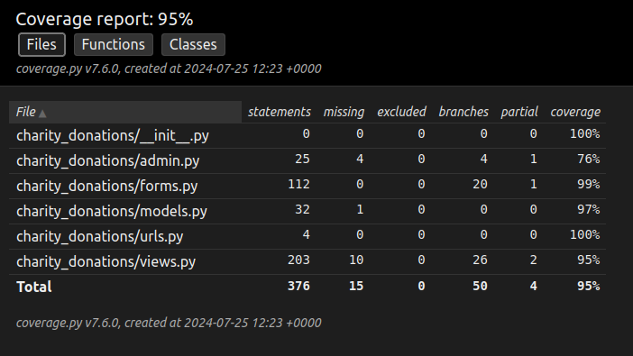

<h1 align="center">Welcome to my <strong>Donate to Charity</strong> project.</h1>

## Description

This is the web app made as a part of python(+frontend) course.
It's an app that allows to donate things (toys, cloths, rugs, food, utilities, home goods, <i>etc.</i> ) to foundations, NGOs or local charities
and to schedule courier to take care of the donated things for user's convenience. 

It was made entirely in Django (both backend and frontend), implementing full CRUD functionality.

I was given part of the front-end (some of the styling and pictures). What I've had done:
- whole backend part (models, views, db setup)
- created new templates and integrated templates from the scaffold templates that we were given for some of the views
- styling for new pages (like settings or user profile)
- JS implementation for pagination, form validation (allowing to get to next step, checking if user has put in valid inputs, <i>etc.</i>)
- tests

## Technologies:
- **Framework:** Django
- **Languages:** Python, JS, CSS, HTML
- **Database:** PostgreSQL
- **Other**: pytest/pytest-django/pytest-cov, venv

## Tests:
Test were done using pytest django and cov for producing coverage report. All the details regarding tests can be found in the `test_views.py` file.  
Here is the coverage report:

## Visualisation:
1. Landing page.

2. Form validation examples:
- allows user to click "next" button only when he fills the current part of the form correctly
- informs the user about the possible mistake he had made

3. User Settings: change information and password.
- View and template 100% done by me from scratch.

4. History of User's donation.
- View and template 100% done by me from scratch.
- Allows user to change the status of donations (user can archive donations which will move them on the bottom of the list and change the color of archived donation.)

## License
You are free to use, modify, and distribute this application for your private, personal use.

## Author
- **email**: mateusz.marciszm@gmail.com
- **github**: [MateuszMarcisz](https://github.com/MateuszMarcisz)
- **CodeWars**: [T0dl3r](https://www.codewars.com/users/T0dl3r)
- **GS**: [GoogleScholar](https://scholar.google.com/citations?user=QW3tlewAAAAJ&hl=en)